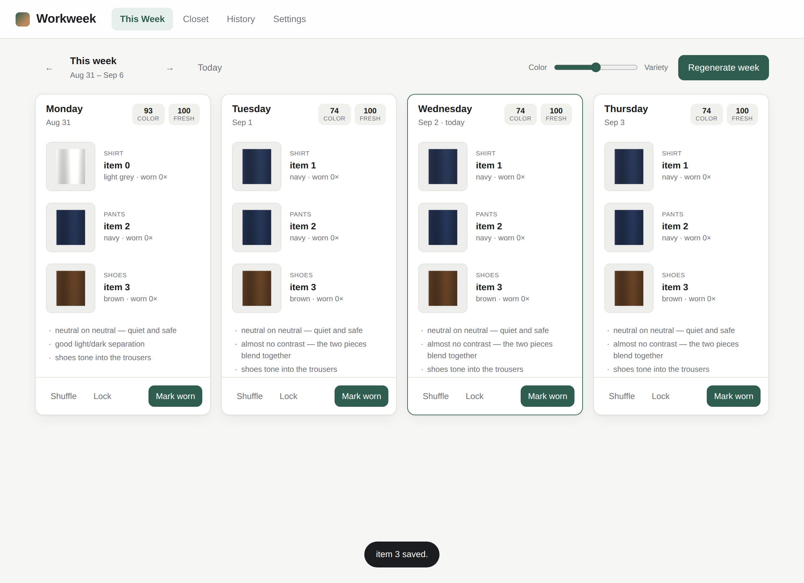
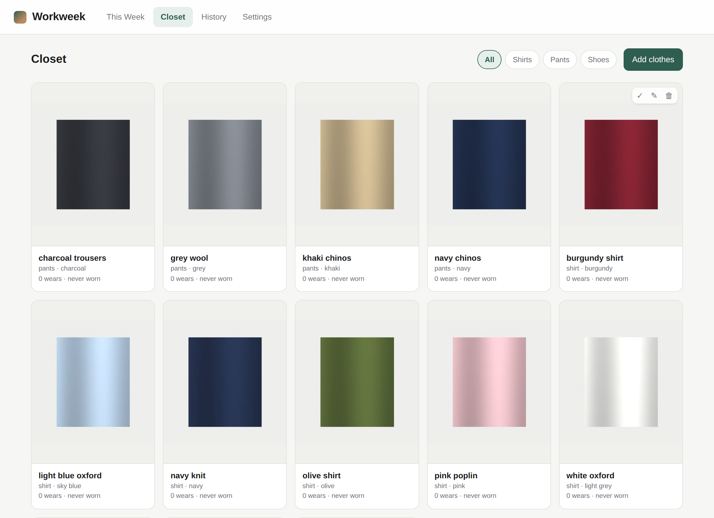

# Workweek

Generates your Monday–Thursday work outfits from photos of your own clothes,
balancing two things you can't easily do by eye: **colors that actually work
together**, and **wearing your whole closet** instead of the same four favourites.

Everything runs in the browser. No account, no server, no photos leaving your
machine.





## Running it

It's a static site with no build step.

```bash
# any static server works
python3 -m http.server 8080
# then open http://localhost:8080
```

Opening `index.html` directly from the filesystem won't work — browsers refuse
IndexedDB access on `file://` origins.

To put it online, push this repo and turn on **GitHub Pages** (Settings → Pages
→ deploy from branch, root folder). There's nothing to build.

## Using it

1. **Closet** — **Add clothes** opens the entry panel; dragging photos anywhere
   over the closet opens it too. Drop several at once and they queue up, one
   after another, and the panel closes itself when the last one is saved. Each
   item gets a name, a category, and a color the app reads off the photo. The
   four swatches next to the picker are the other colors it found, in case it
   grabbed your wall instead of your shirt.
2. **This Week** — four outfits, generated. Each shows why it was picked.
   - **Shuffle** re-rolls one day, avoiding what the other days are using.
   - **Lock** pins a day you like so regenerating leaves it alone.
   - **Mark worn** logs it, which is what feeds the variety tracking. This is
     the one habit the app needs from you — without it, it can't know what
     you've actually worn.
   - The **Color ↔ Variety** slider decides how the two priorities trade off.
3. **History** — what you've worn, how much of your closet you've actually got
   through, and which pieces are still sitting unworn.
4. **Settings** — work days, rotation gaps, and backup.

Bench an item (the ✓ button on a closet card) to keep it while taking it out of
rotation — laundry, seasonal, or a shirt you've gone off.

## How outfits get picked

Every possible shirt + pants + shoes combination is scored on two axes, and the
slider sets the blend.

### Color

Scoring follows the rules people actually dress by, in `js/color.js`:

- **Neutrals do the heavy lifting.** Navy, olive, khaki, denim, cream, grey,
  black and brown are treated as neutrals even though several are saturated
  hues, because that's how they behave in a wardrobe. A neutral next to a color
  is the highest-scoring pairing there is.
- **Hue relationships.** Neighbours on the color wheel (analogous) and opposites
  (complementary) both read as deliberate. The arc in between is the awkward
  zone and gets marked down hard.
- **Two loud colors fight.** Both pieces heavily saturated is a penalty.
- **Contrast matters regardless of hue.** Two pieces of similar brightness blur
  into one shape, so low light/dark separation is penalised even when the hues
  are fine — that's why charcoal-on-charcoal scores below white-on-navy.
- **Shoes answer to the trousers.** Weighted toward the pants, with the two
  classic rules enforced: black shoes fight brown or tan trousers, brown shoes
  fight black ones. Shoes matching the trouser tone is fine, unlike clothes.

### Variety

Per item, in `js/outfit.js`:

- **Under-use** — how far below the rest of its category this item's wear count
  sits.
- **Recency** — how long since it was last worn, measured against a target gap
  that scales with your closet. With 20 shirts and four wearing days, a shirt
  should come round about every five weeks, and that's the gap it rewards. A
  small closet gets a proportionally smaller target, so the rule never becomes
  impossible to satisfy.
- Anything worn recently is heavily discounted, never-worn items go to the front
  of the queue, and a shirt + pants pairing you've had recently is penalised
  even when both pieces are individually due.

Within a week no item repeats — unless your closet is too small, in which case
repeats get *priced* rather than blocked, so two shirts across four days
alternate evenly instead of the better-scoring one running three times.

## Your data

Out of the box the closet, the photos and the history live in this browser's
IndexedDB — nothing is uploaded and each browser keeps a separate closet.
Photos are downscaled to 700px on the way in. Turn on sync below and the same
closet follows you across devices instead.

**Settings → Export** writes a single JSON file with the images embedded. On a
phone it opens the share sheet (AirDrop, Messages, a cloud drive); elsewhere it
downloads. **Import** replaces what's there, photos and wear history included.
Useful as a backup whether or not sync is on.

## Syncing across devices

Optional, off by default, and it needs a Firebase project of your own. Photos
are stored in Firestore rather than Cloud Storage specifically so that the free
Spark plan is enough — **no billing account or credit card required.** A 700px
JPEG is 60–120KB against a 1 GiB allowance, so a large closet uses a few MB.

**In the [Firebase console](https://console.firebase.google.com):**

1. **Add project.** Name it anything; Google Analytics can be off.
2. **Build → Firestore Database → Create database.** Choose *production mode*
   and a region near you.
3. **Build → Authentication → Get started → Google → Enable**, set a support
   email, Save.
4. **Firestore Database → Rules**, replace what's there with the contents of
   [`firestore.rules`](firestore.rules), and Publish. This is the part that
   actually protects your data — don't skip it.
5. **Authentication → Settings → Authorized domains → Add domain**, and add the
   domain you serve the app from (e.g. `titanturtle90.github.io`).
6. **Project settings (gear) → Your apps → Web (`</>`)**, register the app, and
   copy the `firebaseConfig` values.

**In this repo:** copy `apiKey`, `authDomain`, `projectId` and `appId` from that
snippet into [`js/firebase-config.js`](js/firebase-config.js), then commit and
push. Use the values from *your* console — the placeholders in that file are
shaped like the real thing but belong to no project, and sign-in fails with
Google's unhelpful "the requested action is invalid" if they are left in. The
app checks for them and says so in Settings.

**On each device:** open the app → **Settings → Sign in with Google**.

The first device you sign in on uploads the closet it already has. Sign in on
the others and the same closet appears, updating live as you add clothes or
mark outfits worn. Signing out returns that browser to its own local copy.

Those config values are safe to commit: Firebase web config is public in every
app that uses it, and it grants nothing on its own. The security rules are what
matter, and they allow a signed-in person to read and write their own closet
and nothing else — verified against the emulator for unauthenticated reads,
cross-user reads and writes, and access outside `/users`.

Leave `js/firebase-config.js` blank and none of this exists: no sign-in UI, no
network calls, and the Firebase SDK is never even downloaded.

## Tests

The two engine modules are pure and covered by a dependency-free suite:

```bash
node tests/engine.test.js
```

73 assertions over color naming and classification, the harmony and shoe rules,
date handling, week generation, degenerate closets (empty, no shoes, fewer
clothes than days), locking, single-day re-rolls, and a twelve-week rotation
simulation that asserts wear counts stay within one of each other while the
average color score holds above 85.

## Layout

```
index.html            markup for all four views
styles.css            styling, light and dark
js/color.js           color math, garment naming, extraction, harmony rules
js/outfit.js          scoring and week generation  (no DOM, no storage)
js/db.js              local IndexedDB store
js/cloud.js           Firestore store — same interface as db.js
js/store.js           picks between the two; the app only ever calls this
js/firebase-config.js your Firebase project, or blank for local-only
js/app.js             UI wiring
firestore.rules       security rules to paste into the Firebase console
tests/engine.test.js
```

`color.js` and `outfit.js` touch neither the DOM nor storage, which is what
makes them testable in plain Node. `db.js` and `cloud.js` expose the same
fourteen methods, so `store.js` can swap one for the other at sign-in without
any call site knowing.
